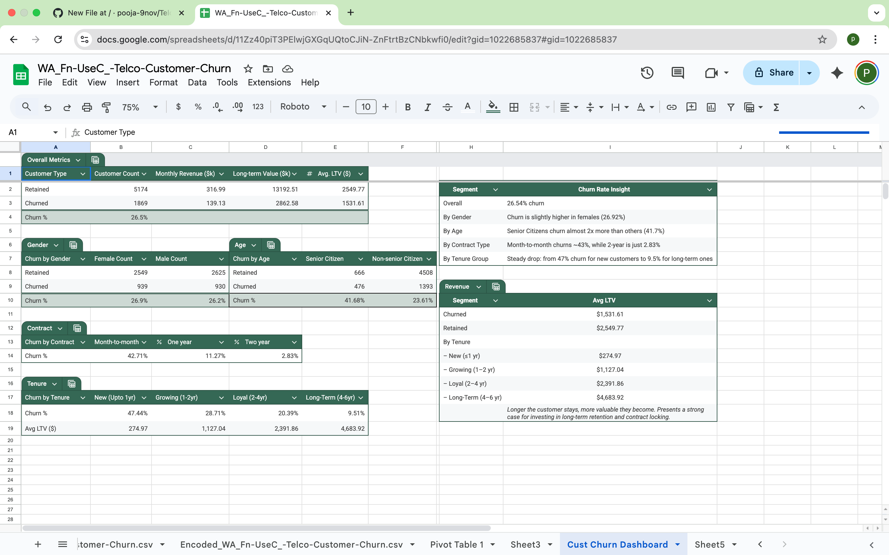
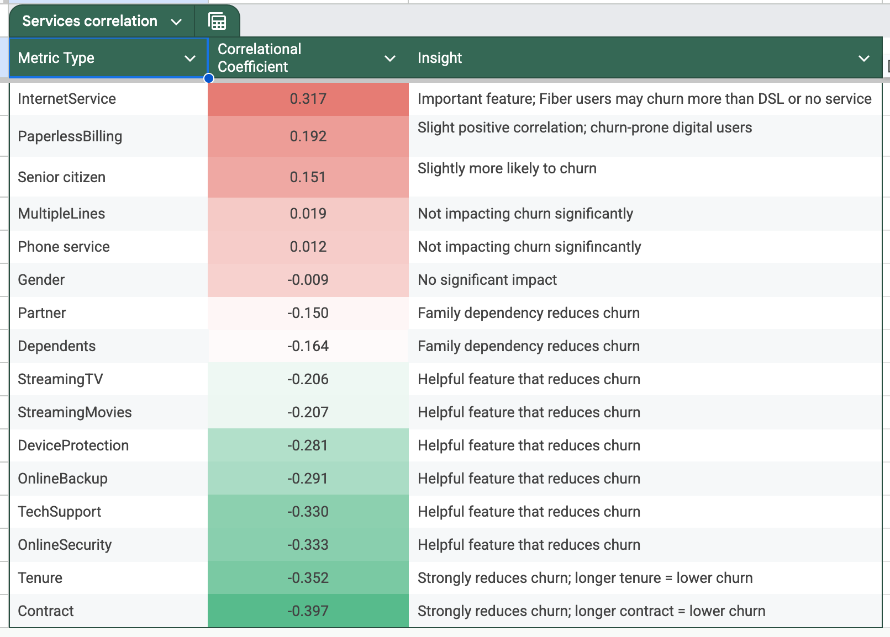
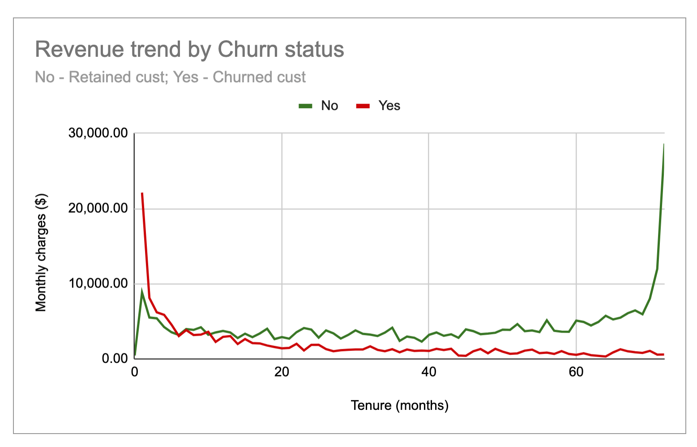

# TelcoCustChurn
Telco customer churn and financial analysis

**Tools:** Microsoft Excel (pivot tables, charts, formulas)

## 🚀 Project Overview
- **Objective:** Analyze customer churn, LTV, and revenue trends to inform retention and upsell strategies.
- **Dataset:** Telco Customer Churn (7,043 customers)

## 🔍 [Key Analysis](analysis/Key_insights.png)
1. **Overall Churn & LTV Segmentation**
   - Retained cust have 66% higher avg LTV than churned.[Link here](analysis/Churn_percentages.png)
2. **Churn Drivers**
   - Month-to-Month contract and low tenure have high churn risks.[Link here](analysis/Correlation_table.png)
3. **Upsell Targets**
   - 400+ long-tenure Month-to-month customers with low spend identified.[Link here](analysis/Upsell_target.png)
4. **Revenue Trends by Churn Status**
   - Retained revenue grows steadily with tenure; churned revenue peaks early.[Link here](analysis/Churn_by_tenure.png)
---
## 📷 Screenshots

### Dashboard

### Correlation with Churn

### Churn by Tenure

---

## 📁 Files
- `/data/Dataset.xlsx` – Cleaned & encoded data
- `/dashboard/Cust_churn_dashboard.png` – Excel dashboard
- `/analysis/` – Key analysis
- `/data/Excel_pivots_analysis.xlsx` - Supporting pivot tables

---
